## Product Vision Statement

A LAN-only progressive web app that helps households stay coordinated on shared recurring responsibilities — from six-month maintenance tasks to weekly meal planning — through smart reminders, a collaborative meal planner, and per-user notification control. Built to feel polished and approachable for non-technical family members.

---

## Core Features (MVP)

**Household**
- Create a household, invite members via join code, one head-of-household owner
- Multi-household data model from day one even though only one is used initially
- Household settings include `week_reset_day` (default Monday)

**Recurring Tasks**
- Create tasks with a name, recurrence interval, and tier (long / medium / short)
- Mark complete — timer resets from completion date, not original due date
- Every completion records user + timestamp (audit log)

**Meal Planner**
- Weekly meal list scoped by `week_of` date, auto-resets on configured day
- Add meals from the household library or free-type a one-off
- When free-typing, prompt "save to library?" after adding
- Remove meals from the current week's list
- Meal library entries store `created_by` and `created_at`

**Push Notifications**
- PWA push notifications, subscribed to all tasks by default
- Per-user, per-task opt-out stored as `NotifPreference` rows (only unsubscribes saved)

**Auth**
- Username + PIN, LAN-only, no email

---

## Updated Data ModelThe dashed line from `MealLibrary` to `WeeklyMeal` captures the nullable relationship nicely — a weekly meal entry either references a library item or it doesn't.

---

## User Stories (Final MVP)

**Household setup**
- As the head of household, I want to create a household and share a join code, so that family members can join without me setting them up manually.
- As a new member, I want to join with a username and PIN, so that I'm in immediately with no friction.

**Recurring tasks**
- As any member, I want to create a recurring task with a name, tier, and interval, so that the household gets reminded automatically.
- As any member, I want to mark a task complete, so that the next reminder schedules itself from today.
- As any member, I want to view who completed a task and when, so that there's no ambiguity about what's been handled.

**Meal planning**
- As any member, I want to add meals to this week's list from the library or by typing freely, so that planning is fast regardless of what we feel like.
- As any member, when I type a new meal, I want to be prompted to save it to the library, so that good meals aren't lost.
- As any member, I want to remove a meal from the current week if plans change.
- As any member, I want the weekly list to reset automatically on the household's configured day.

**Notifications**
- As any member, I want to receive push notifications for all tasks by default.
- As any member, I want to opt out of notifications for specific tasks I don't care about.

---

## Implementation Order

1. Project scaffolding — ASP.NET API + React PWA shell
2. Multi-household data model + migrations
3. Auth — username, PIN, session tokens
4. Household creation + join code flow
5. Recurring task CRUD + completion logic + audit log
6. Service worker + Web Push notification infrastructure
7. Notification opt-out preferences
8. Meal library CRUD
9. Weekly meal planner — add from library, free-type, "save to library?" prompt, auto-reset
10. Design pass + polish

---

## Open Questions (Remaining)

- Should the join code expire, or is it permanent until regenerated? (Security is low priority given LAN-only, but worth a decision)
- Is `week_reset_day` configured once at household creation, or can it be changed later?
- Early risk to validate: PWA push notifications on iOS — test this before Sprint 3, not after
